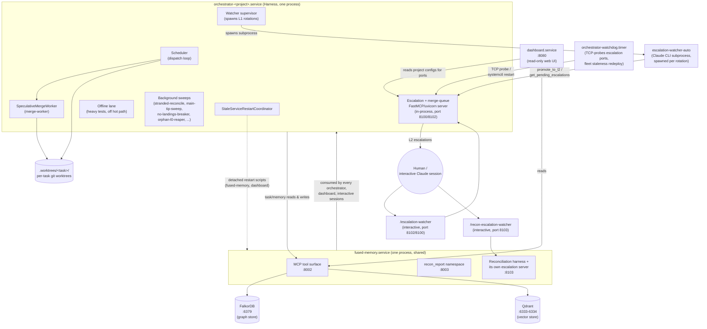
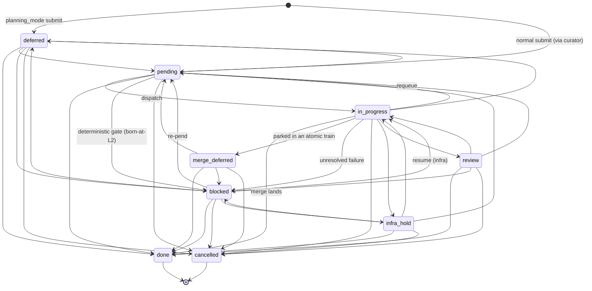
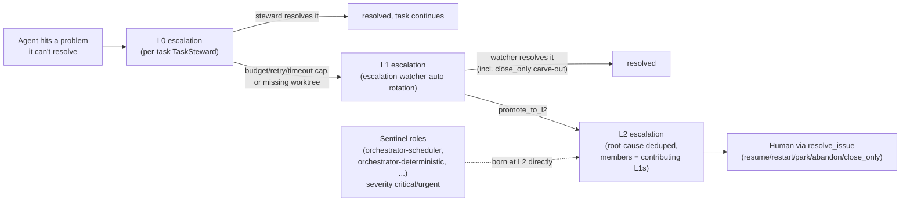

# Architecture

This document explains how dark-factory is put together: what processes run,
how a task moves from submission to `done`, who the agents are, how code
lands on `main`, how escalations reach a human, and what to watch out for. It
is written for someone who has cloned this repo and is about to point it at
their own project.

For narrower or deeper detail, see:
- [README.md](README.md) — what dark-factory is and how to try it.
- [SETUP.md](SETUP.md) — installing backing stores and wiring a new project.
- [OPERATIONS.md](OPERATIONS.md) — the operator runbook (config reload, fleet
  redeploy, model routing, troubleshooting).
- [docs/task-authoring.md](docs/task-authoring.md) — how to write tasks
  (dependencies, `task_kind`, milestones, metadata vocabulary).
- [DESIGN.md](DESIGN.md) — the fused-memory subsystem (Graphiti + Mem0) in
  detail.
- [RECONCILIATION_PLAN.md](RECONCILIATION_PLAN.md) — how memory and tasks
  stay consistent with each other and with git history.

---

## 1. System overview

dark-factory is an autonomous software factory: long-running processes that
pull tasks from a queue, dispatch them to Claude agents that plan and
implement changes in isolated git worktrees, verify and review the result,
and land it on `main` through a merge queue — with a three-tier escalation
ladder surfacing anything an agent can't resolve to a human.

Three kinds of long-lived process:

- **One orchestrator process per target project** — the thing that actually
  runs tasks against a codebase, one instance per onboarded project (see
  [SETUP.md](SETUP.md)). It is a single Python process
  (`orchestrator/src/orchestrator/harness.py`, class `Harness`) running
  roughly a dozen cooperating asyncio components: a scheduler, a speculative
  merge worker, an in-process escalation/merge-queue server, a watcher
  supervisor that spawns Claude CLI subprocesses, an offline test lane, and
  several background sweeps. §2 breaks this down.
- **One shared fused-memory service for the whole fleet** — a single process
  (`fused-memory/src/fused_memory/server/main.py`) every orchestrator, the
  dashboard, and interactive Claude sessions talk to. It fuses a temporal
  knowledge graph (Graphiti, backed by FalkorDB) with a vector memory store
  (Mem0, backed by Qdrant) and proxies task management (Taskmaster AI) — see
  [DESIGN.md](DESIGN.md). It also runs its own reconciliation harness and a
  separate escalation queue for reconciliation-integrity findings.
- **One dashboard process** that reads (never writes) the state produced by
  the above — active tasks, merge queue, escalations, costs, burndown — over
  a web UI.

Humans and human-driven agents interact with all of this through Claude Code
**skills** (`/orchestrate`, `/unblock`, `/prd`, `/escalation-watcher`,
`/review`, etc. — see `skills/`), not by calling the underlying processes
directly.

### Process topology



---

## 2. Process topology in detail

### 2.1 The orchestrator process (`Harness`)

Entry point: `orchestrator/pyproject.toml` (`orchestrator = "orchestrator.cli:main"`)
→ `orchestrator/src/orchestrator/cli.py` `main()` → `Harness.run()`
(`orchestrator/src/orchestrator/harness.py`, class `Harness`).

It is **one process** — no separate scheduler daemon, merge daemon, or
escalation server binary; all of it is asyncio tasks inside `Harness`.
`Harness._build_lifecycle_registry()` registers an ordered `LifecycleRegistry`
(`orchestrator/src/orchestrator/background_service.py`) that starts, in
order: `escalation-server`, `merge-worker`, `offline-lane`,
`orphan-l0-reaper` (conditional), `terminal-status-watcher` (conditional),
`watcher-supervisor`, then the conditional sweeps `stranded-reconcile`,
`main-tip-sweep`, `no-landings-breaker`, `deterministic-recon-sweep`,
`warm-lane-gc`. `escalation-server` and `merge-worker` start first so the
rest of the system has somewhere to file problems and somewhere to land
code from the moment it comes up.

The **scheduler** (`scheduler.py`, class `Scheduler`) is not a lifecycle
entry — it's driven directly by `Harness.run()`'s own loop, calling
`Scheduler.acquire_next()` to decide what to dispatch next (§3.3).

**Escalation and the merge queue share one server.** The same in-process
FastMCP app (`escalation.server.create_server`, wired in
`Harness._start_escalation_server`) hosts both the escalation tools
(`escalate_blocker`, `resolve_issue`, `get_pending_escalations`, ...) and the
merge-queue tools (`merge_request`, `merge_status`, `get_merge_queue`,
`halt_merge_queue`), on `escalation.host`/`escalation.port` from the
project's config — default `127.0.0.1:8100`; this repo overrides it to
`8102` (port map in §2.3).

The **watcher supervisor** is on by default but does *not* run L1 triage
in-process: it periodically checks whether there's anything actionable to
triage, and if so spawns a **Claude CLI child process**
(`asyncio.create_subprocess_exec` in `agents/invoke.py`) running the
`escalation-watcher-auto` skill against the escalation server over loopback
HTTP, bounded by crashloop/backoff/cost-ceiling guards. This is a different
"watcher" from the inotify-based CLI helper
(`escalation/src/escalation/watcher.py`) that a per-task steward spawns just
to wake itself on new escalation files — don't conflate the two.

The **restart coordinator** (`service_restart.py`,
`StaleServiceRestartCoordinator`) also lives inside the harness, not as a
separate process — it arms on merge-landed events and fires detached
restart scripts for fused-memory and the dashboard (see
[OPERATIONS.md](OPERATIONS.md)).

### 2.2 fused-memory (shared, one process, three ports)

A single long-lived process (typically `fused-memory.service`), one instance
for the whole fleet. Entry: `fused-memory/src/fused_memory/server/main.py`
`run_server()`. It binds **three HTTP servers in one process**:

- **`:8002`** — the primary MCP tool surface: Graphiti + Mem0 + Taskmaster,
  unified (see [DESIGN.md](DESIGN.md)).
- **`:8003`** — a second uvicorn instance serving the `recon_report` MCP
  namespace, run concurrently via `asyncio.gather` alongside `:8002`.
- **`:8103`** — the reconciliation harness's *own* escalation server, started
  in-process by `ReconciliationHarness._start_escalation_server`
  (`fused-memory/src/fused_memory/reconciliation/harness.py`) using the
  **same** `escalation.server.create_server` factory the orchestrator uses.
  Structurally it's a second, independent instance of the identical
  escalation-server code, scoped to reconciliation findings rather than
  task-pipeline findings (§6.1).

### 2.3 Everything else

- **Dashboard** — a separate process/systemd unit
  (`dashboard/dark-factory-dashboard.service`) plus a companion watchdog and
  load-sampler unit. Discovers orchestrator instances by reading each
  registered project's `dark-factory-orchestrator.yaml` (`escalation.port`);
  reads fused-memory and its own SQLite DBs read-only.
- **`scripts/orchestrator-watchdog.py`** — a systemd-timer oneshot
  (`OnBootSec=30`, `OnUnitActiveSec=60`). Its liveness pass TCP-probes each
  orchestrator's escalation port and revives a wedged unit immediately; its
  separate staleness pass allows at most one fleet-wide redeploy per 8
  hours (shared clock file `data/orchestrator/last_redeploy_orchestrator.json`),
  delegating to `scripts/restart-all-orchestrators.sh --drain`. Full
  redeploy story (liveness vs. staleness vs. coordinator) in
  [OPERATIONS.md](OPERATIONS.md).

**Process → contains → talks-to**

| Process (unit) | Contains (in-process) | Talks to |
|---|---|---|
| `orchestrator-<project>.service` (`Harness`) | Scheduler; `SpeculativeMergeWorker`; escalation + merge-queue FastMCP/uvicorn server; watcher-supervisor loop (spawns `escalation-watcher-auto` subprocesses); offline-lane worker; conditional background sweeps; `StaleServiceRestartCoordinator` | fused-memory `:8002` (task store/memory); its own escalation server via loopback; detached restart scripts |
| `fused-memory.service` | Main MCP server (`:8002`); `recon_report` uvicorn (`:8003`); `ReconciliationHarness` incl. its own escalation server (`:8103`) | consumed by every orchestrator, the dashboard, and interactive sessions; `/recon-escalation-watcher` connects to `:8103` |
| `dark-factory-dashboard.service` | Dashboard web app (uvicorn `:8080`); companion watchdog + load-sampler units | reads project configs for ports; reads fused-memory `:8002`; reads SQLite DBs |
| `orchestrator-watchdog.timer`/`.service` | oneshot watchdog script | TCP-probes escalation ports; `systemctl --user` cycles wedged units; delegates fleet redeploys |
| interactive Claude sessions (`/escalation-watcher`, `/recon-escalation-watcher`) | separate CLI sessions, not a service | MCP clients to the escalation port (`:8100`/`:8102`) and/or `:8103`, plus `:8002` |

**Port map**

| Port | Owner | Purpose |
|---|---|---|
| 8002 | fused-memory (primary) | Main fused-memory MCP surface (Graphiti + Mem0 + Taskmaster) |
| 8003 | fused-memory (same process) | `recon_report` MCP namespace |
| 8100 | orchestrator (code default) | Default escalation + merge-queue MCP for projects that don't override it |
| 8102 | orchestrator (this repo's override) | This repo's escalation + merge-queue MCP; matches `.mcp.json` so interactive sessions share the same server |
| 8103 | fused-memory (reconciliation harness) | Reconciliation-integrity escalation queue (`recon_failure`, `recon_integrity_issue`, `recon_stale_run`, `recon_backlog_overflow`), consumed by `/recon-escalation-watcher` |
| 8080 | dashboard | Web UI (uvicorn, bound to `127.0.0.1`) |
| 6379 | FalkorDB (docker) | Graph store backing Graphiti |
| 6333–6334 | Qdrant (docker) | Vector store backing Mem0 |

Each onboarded project gets its own unique escalation port (lowest free port
≥ 8100, allocated by `/factory-init`'s port finder), so multiple projects'
orchestrators can run concurrently without colliding.

### 2.4 Worktrees and sandboxing

Every in-progress task gets its own git worktree under
`.worktrees/<task-id>/` on branch `task/<id>` (`GitConfig.worktree_dir`,
default `.worktrees`), alongside ephemeral merge/probe/sweep worktrees
(`_merge-<uuid>`, `_mainprobe-<hex>`, `_mainsweep-<hex>`). Warm lanes
(pre-created, reused worktrees) exist in code (`warm_lane_pool.py`) but
default off and are not enabled for this project.

An OS-level sandbox (bubblewrap/Landlock) for implementer/debugger agents is
built and wired (`SandboxConfig`, `agents/sandbox_dispatch.py`) but is
**disabled by default** across the fleet today — see §9. This is separate
from fused-memory's reconciliation confinement
(`reconciliation/sandbox_guard.py`), which *is* enabled and fail-closed in
production.

---

## 3. Task lifecycle

### 3.1 Status vocabulary

Every task's status is one of (`shared/src/shared/task_statuses.py`):
`pending`, `in-progress`, `blocked`, `deferred`, `review`, `merge-deferred`,
`infra-hold`, `done`, `cancelled`. `done` and `cancelled` are terminal.
`deferred`, `blocked`, and `merge-deferred` are "workflow-preserve" states —
the task's in-flight plan and artifacts are kept, not discarded, while it
waits.



Legal transitions are a closed table (`shared/src/shared/task_transitions.py`)
enforced by fused-memory's `TaskInterceptor`, keyed by the actor making the
change — e.g. reconciliation is never allowed to transition a task *out of*
`in-progress`. The diagram above is that table in full, not a happy-path
sketch: every one of its 37 edges is a `TRANSITIONS` pair, and
`shared/tests/test_architecture_doc_transition_parity.py` asserts set-equality
in both directions, so an edge added to the table cannot silently rot out of
the diagram (it had lost 19 of them before that test existed). Many of the
drawn edges are operator or sweep recovery paths rather than normal flow —
`blocked --resume(infra)--> in-progress`, the `infra_hold`/`review` fan-outs,
and reconciliation's any-non-terminal → `cancelled` family. One recovery path
is deliberately *absent* from the table and so cannot be drawn: the rare,
audited `done`/`cancelled --reopen--> *` (requiring an explicit
`reopen_reason`), which `is_legal_transition` gates on its `reopen` flag
instead of on a `(from, to)` pair.

### 3.2 Submit

Tasks reach the queue through `mcp__fused-memory__submit_task`
(`fused-memory/src/fused_memory/server/tools.py`), in two modes:

- **Ticket/curator path (default).** `submit_task` persists a ticket
  (`{"ticket": "tkt_..."}`) and returns immediately; an async `TaskCurator`
  (`fused-memory/src/fused_memory/middleware/task_curator.py`) dedupes,
  combines, or creates the real task row in the SQLite backend
  (`<project_root>/.taskmaster/tasks/tasks.db`).
- **`planning_mode=True` path.** Used by `/prd` batch decomposition: writes
  the task directly in status `deferred`, bypassing the curator, so a whole
  batch of interdependent tasks can be authored and wired together (deps,
  metadata) before a single `commit_planning` call releases them all to
  `pending` at once.

Workflow roles (architect, implementer, steward, deep_reviewer) also file
fire-and-forget follow-up tasks via `submit_task` as they work.

### 3.3 Scheduler tick

`Scheduler.acquire_next()` runs a **21-phase pipeline** every tick
(`orchestrator/src/orchestrator/scheduler.py`, `_TICK_PHASE_ORDER`):

```
backfill_dep_status → backfill_terminal_dep_records → drain_park_eviction →
park_gc → stale_sweep → cooldown_gc → redispatch_stranded_blocked →
external_dep_policy → delivered_check_gate → stamp_milestone →
override_snapshot_gc → reserve_now → override_diff → compute_priorities →
build_candidates → landed_outbox_gate → starvation → empty_candidate_gate →
psi_gate → select_pins → select_scored
```

The first phase that short-circuits ends the tick early; otherwise
`select_pins`/`select_scored` produce the next `TaskAssignment`. A task
becomes dispatch-eligible only once every dependency gate is satisfied:

- **Local dependencies** — must be `done`/`cancelled` (terminal); a
  dependency parked mid-atomic-train as `merge-deferred` is also accepted.
- **External (cross-project) dependencies** (`metadata.external_deps`) —
  resolved via `get_external_statuses`; satisfied only on exactly `done`
  (cancelled → immediate escalate-and-block; unresolvable → grace-then-
  escalate; resolver error → fail-safe wait). Full field reference:
  [docs/task-authoring.md](docs/task-authoring.md).
- **Delivered-checks** (`metadata.delivered_checks`) — a per-tick sweep
  (`_compute_delivered_check_cache`) asserts a claimed capability is
  actually present on the committed `main` tree, not just that the
  dependency's status reached `done`.
- **Milestones** (`metadata.milestone`) — a `dated` or `delayed` time gate,
  independent of `task_kind`.

Beyond dependency gates, a live-claimant check, a dispatch cooldown, and
fairness/starvation logic (skip-threshold parking for repeatedly-passed-over
tasks) all factor into whether a ready task is actually selected. Eligible
tasks are scored by
`score = TIER_BASE[priority] + min(age_alpha·age + cpm_beta·log1p(transitive_dependents), TIER_WIDTH-1)` —
tier-bucketed so priority dominates, with age and downstream fan-out
breaking ties within a tier.

### 3.4 Dispatch

`Harness._run_slot` first checks `scheduler.is_deterministic(task)` **before**
any worktree, branch, or agent is created. Deterministic tasks
(`task_kind='deterministic'`) go straight to the `DeterministicRunner` — a
small state machine with no git/agent involvement at all (§3.8). Everything
else builds a `TaskWorkflow`, scheduled under a semaphore bounding total
concurrent tasks (`max_concurrent_tasks`; the shipped package defaults
(`orchestrator/src/orchestrator/defaults.yaml`) set 24 for every project,
over a bare-schema fallback of 3).

### 3.5 PLAN / EXECUTE / VERIFY / REVIEW / MERGE (`TaskWorkflow._drive`)

For a normal task, `TaskWorkflow._drive()`
(`orchestrator/src/orchestrator/workflow.py`) runs, in order:

1. **Setup.** Pre-empt-race check → `set_task_status('in-progress', ...)` →
   `git_ops.create_worktree` (branch `task/<id>`, worktree
   `.worktrees/<id>/`) → task artifacts (`.task/plan.json`, mirrored to a
   durable `.task-meta/` sidecar so state survives an orchestrator restart).
   A ghost-loop check (`_recover_if_already_merged`) sends an already-landed
   branch straight to `done`.
2. **Simple-task fast path (optional).** If `metadata.complexity == 'simple'`
   and no hard-blocker token vetoes it (`migration`, `architecture`,
   `integration test`, `design ... new`, `implement ... new feature`) and
   `metadata.force_full_path` isn't set, `_run_simple_task()` runs: **one**
   Sonnet agent (role `simple_task`) explores, plans, implements, and
   commits in a single session. Success falls through to VERIFY; a terminal
   outcome (done/blocked) ends the workflow there; anything else discards
   the plan and runs the full architect path instead.
3. **PLAN.** `architect` explores the codebase, verifies its premises, and
   builds a step-by-step TDD plan (alternating test-step, implementation-
   step) via plan-tools (`create_plan`/`add_plan_step`/`confirm_plan`).
   Escape hatches let it report the task already done, blocked on a real
   dependency, unactionable, or built on a false premise, instead of forcing
   a plan.
4. **EXECUTE.** `_execute_iterations()` runs `implementer` iteratively over
   the plan: RED test → GREEN implementation → commit → mark the step done.
   After each iteration, a cheap, read-only `judge` agent verdicts whether
   the diff actually represents substantive completion — deliberately
   distrusting the plan's own step-done bookkeeping.
5. **VERIFY.** Scoped test/lint/typecheck commands are derived per-module
   and run through a `VerifyRunnerPool` (prefers a remote runner, falls back
   to local). A failure hands off to `debugger` to fix it and re-verify,
   capped at `max_verify_attempts` (default 5) before escalating.
6. **REVIEW.** `reviewer_comprehensive` — currently the sole reviewer
   (historically several specialists, since consolidated) — reads the diff
   read-only and submits a verdict via a stdio verdict-tools MCP. Blocking
   issues trigger a bounded replan/amendment cycle (`max_review_cycles`/
   `max_amendment_rounds`). Independently, every `review.interval` merges
   (default 40), a `ReviewCheckpoint` runs `deep_reviewer` across recently-
   merged modules for cross-task integration issues, filing its own
   tasks/escalations if it finds any.
7. **MERGE.** `_submit_to_merge_queue()` hands the branch to the merge lane
   (§5).
8. **DONE.** `_finalise_merged_done()` refreshes `metadata.files` from the
   merge diff and calls `scheduler.mark_done(kind='merged', sha=...)`. Every
   write of `done` must carry a `done_provenance` (`kind='merged'` or
   `'found_on_main'` on the normal code paths — see
   [docs/task-authoring.md](docs/task-authoring.md) for the
   deterministic/operational provenance kinds) — enforced server-side and
   backstopped by `git merge-base --is-ancestor`.

### 3.6 Escalation on failure

An unresolved failure at any stage moves the workflow to `ESCALATED` and
starts a persistent per-task `TaskSteward`
(`orchestrator/src/orchestrator/steward.py`) — a single Claude session,
opus-backed, with a lifetime budget, that owns every escalation for that
task. `steward` is the **only** role permitted to call `set_task_status`
(enforced by an `AgentRole` capability assertion at import time — §4). The
steward tries to resolve the issue itself; if it can't (budget exhaustion,
retry/timeout/empty-output cap, a missing worktree at preflight), it
auto-escalates to a human, starting the L1→L2 promotion path in §6.

`ESCALATED` has exactly **two** dispositions, and which one a task takes is
what decides whether its row stays `in-progress` or lands in `blocked`:

- **(a) In-slot bounded wait.** The workflow keeps its slot and its live
  claimant while `_ensure_steward_started()` → `_wait_for_resolution()` runs,
  so an `in-progress` row here is legitimate rather than stranded — the row
  still matches a live, heartbeating claimant (INV-6 `status-matches-liveness`,
  [docs/legibility/design-invariants.md](docs/legibility/design-invariants.md)).
  The wait is bounded by a **progress-refreshed idle window**, not a wall-clock
  deadline (task 3170): every observed advance of the steward's progress
  counter buys another full window, so the hold is one window for a silent
  producer and at most `steward_max_attempts +
  steward_max_timeouts_per_escalation` windows for a steward that keeps
  invoking its agent — bounded by the steward's own attempt ceilings, which is
  the property that makes it INV-7 `holds-owned-and-bounded`-legal. A record
  that is born-at-L2 (severity `critical`/`urgent`) or at `level ≥ 2`
  short-circuits the wait immediately: the orchestrator does not hold a slot
  waiting on a human. This now covers **every** phase, MERGE entry included —
  `_handle_merge_gate_escalations`
  (`orchestrator/src/orchestrator/workflow.py`) replaced the old
  steward-less bail, which returned `ESCALATED` with no steward, no wait and no
  status write, leaving `in-progress` + NULL claimant + an open gating record
  with nothing running to advance it (task 3536 / PRD γ1 / spec §8-E1).
- **(b) Blocked exit.** When the wait concludes without resolution — idle-window
  expiry, steward re-escalation, or a gating record still open on the
  single-shot re-check — `_mark_blocked` parks the row `blocked` and frees the
  slot. The open escalation record then *is* the ownership token and the wake
  edge: resolving it re-pends the task (§6). The gate predicate itself
  (`_is_gating_escalation`) is untouched stop-the-line either way — nothing
  merges past an open gating record.

Which exit status each outcome must write is specified normatively in
[docs/task-escalation-state-spec.md](docs/task-escalation-state-spec.md) §4
(the state × owner table) and §5 (the outcome contract).

### 3.7 Recovery and failure paths

The normative specification of the task-status × escalation-state graph is
[docs/task-escalation-state-spec.md](docs/task-escalation-state-spec.md) — §4
is the state × owner table, §5 the outcome contract, §7 the recovery and sweep
contract. This section is the *descriptive* introduction to it: where the two
disagree, the spec states the intent and the divergence is a defect (the spec's
§8 keeps the live divergence register). The two invariants this section leans
on, INV-6 `status-matches-liveness` and INV-7 `holds-owned-and-bounded`, are
stated normatively in
[docs/legibility/design-invariants.md](docs/legibility/design-invariants.md)
and are not restated here.

- **What `_mark_blocked` actually is.** `_mark_blocked`
  (`orchestrator/src/orchestrator/workflow.py`) is the choke point for
  `TaskWorkflow`'s **own** failure parks, and the only `blocked` writer that
  also spawns the dry-run unblock proposal. It is **not** the only writer of
  the status — every family below stamps `blocked` without it (anchors are
  function + file, deliberately not line numbers: these are god-files whose
  line numbers rot within days).
  - **Sibling workflow paths** — `_persist_blocked_row` (whose docstring says
    it deliberately bypasses `_mark_blocked` to avoid spawning
    `_spawn_dry_run_unblock`), train attribution `_attribute_train_failure`,
    and `_handle_terminal_exit_on_block`, reachable both from `_mark_blocked`
    *and* independently from the dispatch-time `TerminalExitRejection`
    handler.
  - **Harness escalate-and-block gates** (`harness.py`) —
    `_block_and_escalate_external_dep`, `_block_and_escalate_delivered_check`,
    `_block_and_escalate_cross_repo`, `_block_and_escalate_substrate_flip`.
  - **Table B `park`** — `_action_teardown_and_set_status` (`harness.py`), the
    human-resolution effect in §6.
  - **`DeterministicRunner`** — the `_file_*_and_block` family
    (`deterministic_runner.py`: `_file_infra_issue_and_block`,
    `_file_stop_instruction_and_block`,
    `_file_curator_adjudication_missing_and_block`,
    `_file_milestone_gate_and_block`,
    `_file_milestone_check_failed_and_block`). Each wraps the status write in
    `try`/`except` and *log-and-swallows* a failure (the escalation is already
    durable), so it can file the record and still not write `blocked`. These
    are also the `pending → blocked` edge §3.8 depends on — no workflow, and
    so no `_mark_blocked`, is ever involved.
  - **Scheduler retry caps** — `trigger_retry_cap_exhausted`
    (`scheduler.py`).
  - **Human `release_workflow`** — `escalation/src/escalation/server.py`,
    which parks only on the no-live-claimant arm.
  - **Reconciliation** — `_sweep_block_orphan`
    (`fused-memory/.../reconciliation/targeted.py`), the `deferred → blocked`
    edge.
  - And the generic MCP surface: `set_task_status` validates only that the
    status string is in the vocabulary, so any client can write `blocked` with
    zero orchestrator involvement.

  The invariant that actually makes a block non-silent is therefore **not**
  single-writership but ownership: every `blocked` row is expected to carry an
  open escalation record or gate marker that owns its re-entry (spec §3-S3;
  INV-7 `holds-owned-and-bounded`), with the deterministic-MILESTONE park as
  the sanctioned carve-out. `infra-hold`, unlike `blocked`, *does* have a
  single production writer — `_mark_blocked(block_status='infra-hold')`, called
  from the infra-resume path in `workflow.py`.
- **Stranded tasks.** `Harness._reconcile_stranded_in_progress` (`harness.py`)
  sweeps `in-progress` tasks with no live claimant, delegating per task
  to `_reconcile_one_stranded`. Liveness is not guessed: it is the
  `claimant_run_id` + `heartbeat_at` + `is_stranded` oracle in
  `shared/src/shared/task_claimant.py`. The classification itself is a single
  table, `_RECOVERY` in
  `orchestrator/src/orchestrator/task_ground_truth.py`, keyed by
  (status × branch-state × open-escalation × deploy-phase) and defaulting
  fail-safe to `LEAVE` for any shape it does not recognize — including every
  shape with a live claimant. `RecoveryAction` today has four members:
  `MARK_DONE_WITH_PROVENANCE` (branch on `main` or carrying a merge
  marker → `found_on_main`, behind the provenance and delivered-checks gates),
  `REVERT_TO_PENDING` (branch off-main or gone, no open record),
  `RE_FILE_ESCALATION` (a row that lost its record — re-files a
  `stranded_blocked` L1 and deliberately changes **no** status), and `LEAVE`.
  The matching sweep for stranded `blocked` rows is the scheduler phase
  `_phase_redispatch_stranded_blocked` (`scheduler.py`).
- **Pin discrimination — what an open record actually vetoes.** The shared
  classifier `escalation/src/escalation/pins.py` distinguishes a **dead own-L0**
  (`DEAD_L0`) from a **queue-backed L1/L2 handoff** (`QUEUE_HANDOFF`) from a
  non-pinning `info` annotation, fails safe *to* pinning on an unknown severity,
  and treats an unreadable store as a distinguishable third result
  (`classify_pins(records=None)` → `store_unavailable`) rather than as "no
  records". It is **already consumed in production by the done-flip gate**
  (`Harness._already_landed_dispatch_gate`, asking `PinReport.vetoes_done_flip`;
  task 3534 / spec §8-E8) — which is why a genuinely-landed task carrying a
  lone `escalate_info` record no longer re-dispatches forever. What is **not**
  yet rewired is the *stranded-recovery* veto: `_shape()` still folds the
  question to `has_open_escalation = bool(report.open_escalations)`
  (`task_ground_truth.py`) and `_phase_redispatch_stranded_blocked` still
  short-circuits on a bare `get_by_task(tid, status='pending')` truthiness read
  (`scheduler.py`), so at those two sites an open record of *any* level
  and *any* severity holds a strand off. The plumbing is already in place —
  `EscalationRef` carries `severity` and `filing_claimant_run_id` precisely so
  a consumer can feed `classify_pins` without re-reading the store.
  One gap is deliberately still open and should not be read as settled: when no
  escalation queue is injected, `_resolve_open_escalations` returns `[]`, which
  is indistinguishable from a genuine "no open escalations" — the
  collapse the `store_unavailable` result exists to prevent. That is task 3535.
- **Converting a pinned strand (normative — NOT yet landed).** The spec's
  recovery rule is that a stranded row carrying a genuinely-pinning record must
  be **converted to `blocked`** and attributed to that record —
  `CONVERT_TO_BLOCKED` — rather than reverted to `pending` underneath the
  responder or left stranded: nothing new is filed, in-flight work is
  preserved, and the row re-couples to the ladder's existing wake edges. Read
  this as intent, not as current behaviour: `RecoveryAction` has no such member
  today (the enum is the four above, and `CONVERT_TO_BLOCKED` appears nowhere
  in code). It lands via `plans/task-escalation-state-graph-prd.md` leaf δ, in
  log-mode first with enforcement behind the soak gate.
- **Orphaned worktrees.** `Harness._reap_orphan_worktrees` (`harness.py`)
  quarantines, then reaps, `.worktrees/*` directories left behind by a
  crashed or killed workflow.
- **Orphaned L0 records.** A *separate* sweep,
  `Harness._reap_orphan_l0_escalations` (`harness.py`), reclaims L0
  escalation *records* whose steward died without escalating (§6). The two are
  easily conflated — one reaps directories, the other reaps queue rows.
- **Retry caps** bound every retryable failure mode (`requeue_cap=3`,
  `transient_requeue_cap=10`, `max_consecutive_infra_resumes=3`,
  `max_consecutive_merge_thrash=2`, `max_failure_signature_repeat=3`) — past
  the cap, the task escalates instead of looping.
- **Park-and-stop.** If 15 or more distinct tasks land in `blocked` within
  an hour, the scheduler pauses itself entirely (in-flight work and the
  merge queue drain, then dispatch halts) until a human calls
  `resume_scheduler` — a circuit breaker against systemic breakage, not a
  per-task response.

### 3.8 Deterministic tasks (no LLM in the loop)

`task_kind='deterministic'` skips the pipeline above entirely — no worktree,
no branch, no agent, no diff. `DeterministicRunner` runs a small state
machine: an optional committed script (`metadata.before_done`), then an
optional born-at-L2 escalation (`metadata.always_escalates`), then `done`.
This expresses auto-deploys, act-then-ask gates, pure human gates, and (via
`before_done.kind='predicate'`) time-delayed autonomous checks — see
[docs/task-authoring.md](docs/task-authoring.md)'s "Deterministic tasks" and
"Milestones" sections for the full field reference; that's task-author-facing
configuration, not architecture, so it isn't repeated here.

---

## 4. Agent roles

All roles are declared in one registry
(`orchestrator/src/orchestrator/agents/roles.py`, `ROLES`), each an
`AgentRole` dataclass carrying its allowed MCP tool families, model, effort,
budget, and turn cap. `AgentRole.__post_init__` enforces at import time that
a role's `mcp_families` and `allowed_tools` stay consistent. Two invariants
matter most for reasoning about safety:

- **Only `steward` may call `set_task_status`.** Every other role reaches
  `done`/`blocked`/etc. indirectly, through the workflow's own choke points
  (`_mark_blocked`, `_finalise_merged_done`, `DeterministicRunner`) — no
  other agent can unilaterally declare a task's fate.
- **`sandboxed=True`** is set on `implementer` and `debugger` only — the two
  roles that write code. See §9: this sandbox is currently disabled
  fleet-wide, so today this is a scope *declaration* enforced by convention
  and file-locking, not an OS-enforced boundary.

| Role | Stage | Purpose | Model / effort / budget / turns |
|---|---|---|---|
| `architect` | PLAN | Explores the codebase, verifies premises, builds the TDD plan | opus / max / $15 / 100 |
| `implementer` | EXECUTE | RED test → GREEN implementation → commit, per plan step; sandboxed | sonnet / max / $10 / 80 (routed to opus above ~12 steps or ~3 modules) |
| `debugger` | VERIFY failure loop | Fixes test/lint/typecheck failures with minimal changes; sandboxed | sonnet / max / $5 / 50 |
| `reviewer_comprehensive` | REVIEW | Sole reviewer: test quality, reuse, architecture, performance, robustness; read-only | opus / high / $5 / 30 (config resolves `reviewer_comprehensive` → the `reviewer` config key) |
| `judge` | Post-EXECUTE-iteration | Read-only completion verdict on the diff vs. the plan | sonnet / medium / $0.50 / 15 |
| `merger` | Merge-conflict resolution | Conservative conflict resolution with a drop-aware protocol | opus / max / $5 / 50 |
| `steward` | ESCALATED (persistent, per task) | L0 escalation handling; the only role that may set task status | opus / high / $5 / 100 |
| `deep_reviewer` | ReviewCheckpoint (every ~40 merges) | Cross-task integration review; can file its own tasks/escalations | opus / max / $15 / 100 |
| `simple_task` | Fast path (`complexity='simple'`) | Single-agent explore → plan → implement → commit | sonnet / high / $2.50 / 50 |
| `triage` (defined in `agents/triage.py`, outside `ROLES`) | Steward pre-triage of large suggestion batches | ACCEPT/SKIP classification of review suggestions | sonnet / medium / $2 / 25 |
| `module_tagger` (no `AgentRole`) | Pre-dispatch batch | Predicts `metadata.files` for module-lock prediction | haiku / medium / $2 / 30 |
| `unblock_auto` (skill-level) | `/unblock-low-risk`, watcher dry-run | Read-only, risk-labelled fix proposal | sonnet / high / $5 / 50 / 1200s |
| `escalation-watcher-auto` (skill-level) | L1 rotations | Triage loop over pending escalations; rotates on a time/count limit | sonnet / high / $40 per rotation / 400 turns |

A shared staging convention (`git add -- .`) and a background-task warning
apply to `implementer`/`debugger` specifically — both work inside a worktree
where other concurrent processes may also be touching files, so they're
told explicitly not to assume they're alone.

Every LLM invocation's `(model, effort, budget_usd, max_turns)` is actually
resolved by a separate layered resolver (per-task pin → policy rule →
per-role config → role default, each validated fail-safe against an
allowlist) — the table above gives each role's *default*; see
[OPERATIONS.md](OPERATIONS.md)'s "Model routing" section for the full
resolver and rule vocabulary.

---

## 5. The merge lane

Code lands on `main` through a **two-layer speculative merge queue**
(`orchestrator/src/orchestrator/merge_queue.py`, class
`SpeculativeMergeWorker`, run inside the `merge-worker` lifecycle entry —
there is no separate merge process).

### 5.1 Submit/poll protocol

`merge_request` (on the escalation server, §2.1) takes a bounded wait
(`wait_secs`, capped at 100s — never unbounded) and either returns
`already_merged` immediately (fast path) or enqueues via
`coalesce_or_enqueue_merge_request`, which dedupes an in-flight branch by
marking the new request `attached` rather than double-queuing it.
`merge_status(request_id)` reports a live state
(`queued`/`verifying`/`gate`/`finalizing`) or a terminal one
(`done`/`conflict`/`blocked`/`abandoned`/`superseded`/`already_merged`/
`unknown_branch`/`failed`). `merge_cancel` is the only way to actually
cancel a request — a disconnected client does **not** implicitly cancel; the
intent persists. The `/merge-queue` skill implements the correct
submit→poll contract for both humans and agents; prefer it over raw
`git merge`.

### 5.2 Two layers

- **Layer 1 — the speculative suffix.** A reorderable graph of queued
  requests, ordered by conflict footprint. A younger request that conflicts
  with an older one is bounced (a mechanical speculative rebase is tried
  first; a real conflict escalates to the `merger` role); a request bounced
  `MERGE_BOUNCE_CAP` (3) times is blocked with `needs_rebase`.
- **Layer 2 — the frozen verify frontier.** The prefix of
  `{verifying} ∪ {landed}` requests is immutable; the actively-verifying
  request's tests run against that frozen prefix's tip, not a
  constantly-moving `main`.

**Speculation** lets a merger coroutine merge request N+1 against N's
*speculative* SHA while a verifier is still processing N, so verification
isn't serialized behind the slowest test suite in the queue. If N fails
verification, N+1 is re-merged against real `main` and re-verified. Requests
with disjoint file footprints bypass conflict ordering; conflicting
requests are resolved oldest-first by submission time. A
`NoLandingsCircuitBreaker` force-halts the scheduler and files an L2-info
escalation if the landing rate goes to ~zero while disk space is also
shrinking, auto-resuming once a clean landing happens or disk recovers.

### 5.3 Merge, post-merge verify, and red main

`classify_and_merge` checks branch presence, detects an already-merged
branch (preferring a snapshot-tip comparison to avoid false negatives),
performs the merge, and applies a drop-guard. `_run_post_merge_verify` then
re-runs the verify suite against the new `main` tip through the same
`VerifyRunnerPool`, bounded by retry budgets for timeouts, disk-full, and
narrowed-scope retries. `merge_verify_breadth` defaults to `scoped` (touched
modules only) rather than `full` (whole repo) — see §9 for the caveat.

If post-merge verify goes red, the worker classifies whether `main` is
*genuinely* broken (vs. a transient host issue) via a deferred,
off-critical-path re-probe. A confirmed red `main` files a deduplicated L1
escalation and triggers auto-heal attempts. A specific fail-closed gate — an
unscoped post-merge typecheck failure — hard-aborts the autonomous
low-risk-unblock path entirely; fixing a genuinely red `main` from this
state is a human/steward-only action (see [OPERATIONS.md](OPERATIONS.md) and
the `unblock` skill).

### 5.4 Offline lane and halt tools

The offline lane (`orchestrator/src/orchestrator/offline_lane.py`) is a
singleton background worker that runs heavy test suites off the merge hot
path, snapshotting `main` at run start and coalescing advances — it never
gates a merge, and defaults to disabled (`git.offline_lane_enabled: false`).
Operators can inspect and pause the merge lane directly: `get_merge_queue()`
gives a live snapshot (lane states, conflict graph, frozen prefix, metrics)
that the event store alone can't reconstruct; `halt_merge_queue`/
`unhalt_merge_queue`/`get_merge_halt_status` are operator-only controls.

---

## 6. The three-tier escalation ladder

Every escalation is one row in a single model
(`escalation/src/escalation/models.py`, class `Escalation`), distinguished
by `level`:

```
L0  level=0   producer: agent             consumer: steward (per-task, interactive-equivalent review)
L1  level=1   producer: steward/workflow  consumer: escalation-watcher-auto (automated triage)
L2  level=2   producer: auto-watcher      consumer: human (direct — bypasses the auto-watcher)
```



- **L0.** A per-task `TaskSteward` — a single, persistent Claude session
  across every escalation that task ever raises, with a lifetime budget (§4)
  — the first responder for any workflow failure.
- **L0 → L1.** Two routes. Automatically,
  `TaskSteward._auto_escalate_to_human` files a fresh `level=1` escalation and
  dismisses the L0 when the steward exhausts its budget, hits a
  retry/timeout/empty-output cap, or finds its worktree missing at preflight.
  Deliberately, a steward that judges an L0 beyond its own reach re-escalates
  by calling `escalate_blocker(..., level=1)` (task 3236); `level` accepts only
  `{0, 1}`, since an agent must not self-mint an L2. `level=1` is **observed,
  not role-gated**: `agent_role` is a caller-supplied MCP argument, so a gate
  on it would be defeated by passing the string, and a hard reject would drop a
  legitimate steward re-escalation filed under an unexpected role spelling —
  the very swallow task 3236 fixes. A `level=1` from a role that is neither
  `steward` nor a harness sentinel is therefore filed *and* logged at WARNING
  naming the role and task_id. (Contrast the severity axis, which fails safe by
  *downgrading* rather than rejecting — see Born-at-L2 below.) Either way the record is
  outside the workflow's level=0 dismissal sweeps by construction, is visible
  to the level-filtering auto-watcher, and pins the task via
  `escalation.pins` QUEUE_HANDOFF regardless of the filer's liveness. A
  separate orphan sweep (`Harness._reap_orphan_l0_escalations`) reclaims L0s
  whose steward died without escalating.
- **L1 auto-watcher.** A repeatedly-spawned Claude CLI rotation (§2.1) that
  only launches when there's an actionable pending L1, running the
  `escalation-watcher-auto` skill.
- **L1 → L2 (`promote_to_l2`).** The auto-watcher promotes by minting or
  updating a root-cause-deduplicated `level=2` escalation whose `members`
  list references the contributing L1 escalation ids (which stay at level
  1). Promotion is gated to the watcher's own identity or an unauthenticated
  (human) caller.
- **Born-at-L2.** `escalate_blocker`/`escalate_info` called with severity
  `critical` or `urgent` are stamped `level=2` immediately — but **only**
  when the filer's `agent_role` is a recognized harness sentinel (e.g.
  `orchestrator-scheduler`, `orchestrator-deterministic`,
  `orchestrator-watcher-supervisor`, `orchestrator-main-sweep`). A
  non-sentinel filer claiming critical/urgent is silently downgraded to an
  ordinary `blocking` L0 — this prevents an ordinary agent from
  self-promoting straight to human attention.
- **Human resolution (`resolve_issue`)**:

  | Action | Effect on the task |
  |---|---|
  | `resume` | → `pending`, `resume_from_pause` (two preconditions — see below) |
  | `restart` | → `pending`, `restart_from_scratch` |
  | `park` | → `blocked`; the L2 escalation stays open |
  | `abandon` | → `cancelled` |
  | `close_only` | no task effect — closes the escalation without touching the task |

  The table is Table B (`escalation/src/escalation/action_effects.py`), and
  `resolve_issue` itself writes **no** task status — it changes only the
  escalation record and consults `effect_for` purely as a legality gate
  (`escalation/src/escalation/server.py`); the task-status effect is applied by
  the orchestrator harness. `resume_from_pause` is the *disposition* name that
  routes the effect, not a second target status: the row is
  `('resume', ANY, ANY) → TaskEffect('pending', 'resume_from_pause')`, and the
  one production comparison against it (`WORKFLOW_RESUME`, in
  `Harness._on_escalation_resolved`) routes to `_cascade_unblock_member`, which
  sources its target from that same row and so writes `pending`. There is no
  distinct paused-workflow target.

  Two preconditions on `resume` are worth stating, because together they are
  why a **stranded** row is unreachable by it:

  1. **Status string equality, not liveness.** `_cascade_unblock_member`
     (`harness.py`) re-reads the row and returns early at
     `if status != 'blocked'`. Every other status — including an
     `in-progress` row whose claimant is long dead — is DEBUG-skipped.
     (`infra-hold` has its own pre-gate just above, which writes `in-progress`
     instead.) The flip itself sits behind a same-signature re-block guard.
  2. **L0 resolutions never reach it.** `_on_escalation_resolved` nests the
     entire resume disposition inside `if escalation.level >= 1`, so resolving
     an L0 produces no status change at all.

  Normatively this is a defect, not a design: the spec
  ([docs/task-escalation-state-spec.md](docs/task-escalation-state-spec.md)
  §7.4, PRD leaf ζ) requires `resume` to key off **claimant liveness** rather
  than `status == 'blocked'` string equality, and requires the L0-resolution
  path to reach orphaned rows. Neither has landed yet.

  A level cap prevents the watcher's own MCP connection from resolving
  anything at L2 (`level_forbidden`) — except a narrow, evidence-gated
  `close_only` carve-out for three specific classes
  (`superseded_main_sweep`, `self_cleared_infra`, `stale_task_scoped`),
  itself denylisted for human-judgment-only categories like
  `design_concern` and `milestone_gate`. An unauthenticated human caller is
  never restricted by level.

### 6.1 A separate ladder for reconciliation (port 8103)

fused-memory's reconciliation harness runs its **own**, structurally
identical escalation server on `:8103` (§2.2), for a different problem
domain: integrity findings about the memory/task store itself
(`recon_failure`, `recon_integrity_issue`, `recon_stale_run`,
`recon_backlog_overflow`) rather than task-pipeline failures. It is consumed
by the `/recon-escalation-watcher` skill, not `/escalation-watcher` — don't
point one skill at the other's queue. See
[RECONCILIATION_PLAN.md](RECONCILIATION_PLAN.md) for what reconciliation
actually checks.

---

## 7. Memory subsystem (pointer)

fused-memory fuses two stores behind one MCP surface: **Graphiti**, a
temporal knowledge graph (backed by FalkorDB) for entities, relationships,
and decisions that change over time, and **Mem0**, a vector memory store
(backed by Qdrant) for conventions, procedures, and summaries. A single
write router classifies each memory into one of six categories and sends it
to the right store; task management (Taskmaster AI) is proxied through the
same server so task writes emit reconciliation events automatically. The
full design — schema, tool surface, category taxonomy, write-routing rules —
is in [DESIGN.md](DESIGN.md); this document only covers where the process
runs and what ports it exposes (§2.2).

Reconciliation is the separate background process that keeps memory, task
state, and actual git history from silently drifting apart — a three-stage
sleep-mode design that periodically compares what the task store believes
against what's actually true on `main` and in the event log, and files
findings on its own escalation queue (§6.1) when they disagree. The full
design is in [RECONCILIATION_PLAN.md](RECONCILIATION_PLAN.md).

---

## 8. Observability

| Source | Where | Holds |
|---|---|---|
| Event store | `data/orchestrator/runs.db`, table `events` | Append-only structured events: invocation start/end, routing decisions, phase enter/exit, escalation created/resolved, merge events, train events, scheduler paused/resumed, worktree quarantined/reaped, retry-cap-exhausted, external-dep-gate-held, config-reload, and more |
| Run/task results | same DB, tables `runs`/`task_results`/`scheduler_state` | Per-run rollups, per-task outcome/cost/duration, persisted scheduler pause state |
| Cost ledger | same DB, tables `invocations`/`account_events` | Per-LLM-call cost, tokens, model, role, account; enforces daily cost ceilings |
| Merge queue (live) | `mcp__escalation__get_merge_queue` | In-flight/queued requests, conflict graph, frozen prefix, metrics — the blind spot the event store alone misses |
| Task runtime snapshot | `mcp__escalation__get_task_runtime_state` | Live per-task phase/loop/attempt projection |
| Escalations | `data/escalations/` + `get_pending_escalations`/`get_escalation` | Open L0/L1/L2 escalations, categories, resolution history |
| Reconciliation findings | `data/reconciliation/`, consumed via `/recon-escalation-watcher` | Integrity findings from the `:8103` queue |
| Dashboard | `dashboard/src/dashboard/data/*.py` (read-only pool over the same SQLite DBs) | Web UI: active tasks, merge queue, halt state, escalation analytics, task runtime, scheduler state, costs, burndown, recon status |
| journalctl | systemd units (`StandardOutput=journal`) | Raw process logs — the event store is the durable structured record; journalctl is for live tailing and crash forensics |

When debugging, prefer the event store and `get_merge_queue`/
`get_task_runtime_state` over grepping logs — they're the structured,
queryable record; journalctl is for the raw process narrative logs don't
capture (crashes, startup, stack traces).

---

## 9. Known limitations

Being direct about what's built but not (yet) turned on, so you don't assume
a defense is active when it isn't:

- **OS-level sandboxing is built but disabled everywhere today.**
  `SandboxConfig.enabled` defaults to `True` in code, but the shipped
  defaults (`orchestrator/src/orchestrator/defaults.yaml`) override it to
  `false`, and no project config re-enables it. Dispatch resolution
  (`auto → landlock → bwrap → none`) fails open to `none` in practice, so
  `implementer`/`debugger`'s `sandboxed=True` flag is a scope declaration
  today, not an enforced OS boundary. (Separately, fused-memory's
  reconciliation confinement *is* enabled and fail-closed — a different
  subsystem, not covered by this caveat.)
- **Worktrees share the main checkout's virtualenv.** A task's worktree
  under `.worktrees/<id>/` is a separate git working directory, but not a
  separate Python environment — dependency installs in one worktree are
  visible everywhere, and a broken environment change can affect
  concurrently-running tasks.
- **Verify commands default to repo-wide scope in places**, not always
  scoped strictly to the modules a task touched — `merge_verify_breadth`
  defaults to `scoped`, but individual verify command derivation can still
  fall back wider than the minimal touched set: slower than necessary, and
  a source of unrelated flakiness bleeding into a task's verify result.
- **Warm lanes (pre-created, reused worktrees) are off by default.**
  `warm_lane_pool` and the persistent merge/offline-deep worktree options
  all default to `False` in this project's config — every dispatch pays the
  cost of a fresh worktree checkout. Other projects in the fleet do enable
  these; this repo currently doesn't.

None of these are secret — they're deliberate, documented trade-offs (see
`plans/os-sandbox-worktree-containment-research-2026-07-22.md` for the
sandbox rollout status specifically) rather than bugs. If you're adopting
dark-factory for a project with stronger isolation requirements, treat
sandbox enablement as a prerequisite to evaluate, not an assumption.
